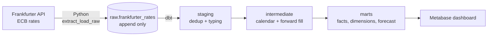

# 💱 Currency Exchange ELT Pipeline

A daily ELT pipeline that loads exchange rates from the [Frankfurter API](https://frankfurter.dev) into PostgreSQL, models them with dbt into tested fact and dimension tables, adds a simple moving average forecast, and serves everything on a Metabase dashboard that is created from code. Orchestrated by Apache Airflow, fully containerized with Docker Compose.

Tracked pairs: **USD** against **IDR**, **MYR** and **SGD**, plus every cross rate between them (for example IDR per MYR).


---

## 🏗️ Architecture



The Airflow DAG `currency_exchange_pipeline` runs on weekdays at 17:00 UTC, shortly after the ECB publishes its reference rates.

```
extract_load_raw >> dbt_deps >> dbt_source_freshness >> dbt_build >> dbt_docs_generate
```

| Task                   | What it does                                                                                      |
| ---------------------- | ------------------------------------------------------------------------------------------------- |
| `extract_load_raw`     | Loads full history on the first run, then the last 7 days. Validates and appends to the raw table |
| `dbt_deps`             | Installs dbt packages                                                                             |
| `dbt_source_freshness` | Stops the run if the newest rate is older than 7 days                                             |
| `dbt_build`            | Runs all models, seeds and tests in dependency order, including the forecast                      |
| `dbt_docs_generate`    | Refreshes documentation and the lineage graph                                                     |

---

## ⚙️ Tech Stack

| Layer               | Tool                                          |
| ------------------- | --------------------------------------------- |
| 🔁 Orchestration    | Apache Airflow 2.10                           |
| 🐍 Extract and load | Python (requests, psycopg2)                   |
| 🧱 Transformation   | dbt Core 1.11 with dbt-postgres and dbt_utils |
| 🗄️ Storage          | PostgreSQL 15                                 |
| 📊 Visualization    | Metabase, provisioned through its REST API    |
| 🐳 Infrastructure   | Docker Compose                                |

---

## 🧬 Data Model

| Schema         | Model                    | Grain                        | Notes                                                   |
| -------------- | ------------------------ | ---------------------------- | ------------------------------------------------------- |
| `raw`          | `frankfurter_rates`      | One row per API row per load | Append only, keeps the original JSON payload            |
| `staging`      | `stg_frankfurter__rates` | Date, base, quote            | Latest loaded version of each rate                      |
| `intermediate` | `int_rates__date_filled` | Calendar day, base, quote    | Weekends and holidays forward filled                    |
| `marts`        | `fct_exchange_rates`     | Calendar day, base, quote    | Incremental. Main table for dashboards                  |
| `marts`        | `fct_cross_rates`        | Calendar day, from, to       | All pairs derived through USD                           |
| `marts`        | `fct_rate_metrics`       | Published day, base, quote   | Daily change, moving averages, volatility, anomaly flag |
| `marts`        | `fct_rate_forecast`      | Forecast day, base, quote    | 30 day moving average for the next 20 business days     |
| `marts`        | `dim_date`               | Calendar day                 | Year, month, ISO week, weekend flag                     |
| `marts`        | `dim_currency`           | Currency                     | Built from the `currencies` seed                        |

<!-- Add a screenshot of the dbt lineage graph here:  -->

---

## 🧠 Design Decisions

**ELT instead of ETL.** Python only moves data. All business logic lives in dbt where it is versioned, tested and documented.

**Append only raw layer.** Every run inserts rows and never updates or deletes. This keeps a full audit trail, lets models be rebuilt from scratch at any time, and makes the load step safe to retry.

**Self managing date range.** The first run finds an empty raw table and loads everything since `HISTORY_START_DATE`. After that, each run re-fetches the last 7 days so late or revised rates are picked up. If the pipeline was down for longer than 7 days, the window extends back to the latest loaded date so no gap is left. Staging keeps the most recently loaded version of each rate.

**Watermark based incremental fact.** `fct_exchange_rates` stores the newest raw `loaded_at` it has seen. On the next run it finds the earliest `rate_date` among raw rows loaded after that watermark and rebuilds from that date forward. Filtering by `rate_date` alone would miss historical backfills. Rebuilding forward matters because a revised Friday rate also changes the forward filled Saturday and Sunday. This logic was verified to produce the same result as a full refresh after both a revision and a backfill.

**Forward fill with a flag.** The ECB does not publish on weekends or holidays. The fact table carries the previous rate forward so charts and joins have no gaps, and `is_filled` marks those rows. Metrics and the forecast use published days only, because filled days would add fake zero returns and repeat the same rate.

**Anomaly flag.** A day is flagged when its log return is 3 or more standard deviations away from the mean of the previous 30 published days. Both numbers are dbt vars in `dbt_project.yml`.

---

## 🔮 Moving Average Forecast

`fct_rate_forecast` is a deliberately simple baseline, built in SQL inside dbt:

1. Take the last 30 published rates for each currency pair
2. Average them
3. Repeat that average for the next 20 business days

The forecast line is flat by design. A moving average estimates the current level of a rate, not its direction. Exchange rates move close to a random walk, so even more advanced models such as ETS usually produce a similarly flat forecast for this data.

Known limitations:

- **Lag.** After a steady rise or fall, the average still reflects older levels, so it can sit above or below the latest rate
- **No uncertainty band.** The forecast shows a single value, not a range
- **Holidays.** Future ECB holidays are not excluded from the 20 business days

This is not a machine learning model and is not meant for trading decisions. Window size and horizon are dbt vars (`forecast_window_size`, `forecast_horizon`).

---

## 📊 Dashboard as Code

The dashboard is not built by hand. On `docker compose up`, the `metabase-setup` container runs `metabase/provision.py`, which uses the Metabase REST API to:

1. Create the admin user from `.env`
2. Connect the currency database
3. Create every chart from `metabase/dashboard.json` and the SQL in `metabase/queries/`
4. Arrange them on one dashboard

It is safe to run again. If the dashboard already has charts, it stops. If an earlier run failed and left an empty dashboard, it fills that one.

| Row | Charts                                                                                                     |
| --- | ---------------------------------------------------------------------------------------------------------- |
| 1   | Latest USD to IDR, MYR and SGD                                                                             |
| 2   | USD to IDR for the last 6 months with the moving average forecast, forecast table for all three currencies |
| 3   | MYR and SGD to IDR, monthly change against USD                                                             |

To change a chart, edit `dashboard.json` or its SQL file, then rebuild the dashboard:

```bash
MB_RECREATE_DASHBOARD=true docker compose up --force-recreate metabase-setup
```

The old dashboard and its questions are moved to the Metabase trash.

---

## ✅ Data Quality

| Where               | Check                                                                                                              |
| ------------------- | ------------------------------------------------------------------------------------------------------------------ |
| Python              | Response shape, required keys, expected currencies, rate above 0                                                   |
| dbt source          | Freshness (warn after 4 days, error after 7)                                                                       |
| dbt generic tests   | `unique`, `not_null`, `relationships` to dimensions, `dbt_utils.unique_combination_of_columns` on every fact grain |
| Custom generic test | `positive_value` for all rate columns                                                                              |
| Singular test       | `assert_no_date_gaps_in_fct_exchange_rates` checks one row per calendar day per pair                               |
| pytest              | Unit tests for API response validation and date range logic                                                        |

---

## 📂 Project Structure

```
currency-exchange-etl/
├── dags/
│   └── currency_exchange_pipeline.py    # Airflow DAG
├── include/currency_pipeline/
│   ├── date_range.py                    # Decides which dates each run fetches
│   ├── frankfurter_client.py            # API call and validation
│   └── raw_loader.py                    # Append to raw.frankfurter_rates
├── dbt/
│   ├── dbt_project.yml
│   ├── profiles.yml                     # Reads credentials from env vars
│   ├── packages.yml
│   ├── macros/generate_schema_name.sql
│   ├── models/
│   │   ├── staging/
│   │   ├── intermediate/
│   │   └── marts/                       # Facts, dimensions, forecast, exposures
│   ├── seeds/currencies.csv
│   └── tests/                           # Custom generic and singular tests
├── metabase/
│   ├── provision.py                     # Builds the dashboard through the Metabase API
│   ├── dashboard.json                   # Chart names, types and layout
│   └── queries/                         # One SQL file per chart
├── docs/                                # Screenshots for this README
├── tests/                               # pytest unit tests
├── Dockerfile                           # Airflow image with dbt in a separate virtualenv
├── docker-compose.yml
└── .env.example
```

---

## 🚀 How to Run

**1. Configure environment variables**

```bash
cp .env.example .env
```

Change the passwords and secret key. `MB_ADMIN_PASSWORD` must be strong enough for Metabase, otherwise dashboard provisioning fails. On Linux, set `AIRFLOW_UID` to the output of `id -u` so containers can write logs and dbt artifacts.

**2. Start everything**

```bash
docker compose up -d --build
```

**3. Run the pipeline.** Open Airflow at `http://localhost:8080`, unpause `currency_exchange_pipeline` and trigger it. Leave `start_date` and `end_date` empty. The first run loads history since `HISTORY_START_DATE`.

**4. Custom backfill (optional).** To load a different range, fill in `start_date` and `end_date` when triggering, for example `2015-01-01` and `2019-12-31`. The incremental fact table detects the older dates and rebuilds from there. No full refresh needed.

**5. Open the dashboard** at `http://localhost:3000` and log in with `MB_ADMIN_EMAIL` and `MB_ADMIN_PASSWORD`. The dashboard is under **Our analytics**. Charts fill in once the DAG has run at least once. Check provisioning with `docker compose logs metabase-setup`.

---

## 🧪 Local Development

```bash
python -m venv .venv && source .venv/bin/activate
pip install -r requirements-dev.txt

# Unit tests
pytest

# dbt against the Docker database (exposed on port 5434)
export DB_HOST=localhost DB_PORT=5434 DB_USER=currency_user DB_PASS=change_me DB_NAME=currency_db
cd dbt
dbt deps --profiles-dir .
dbt build --profiles-dir .
dbt docs generate --profiles-dir . && dbt docs serve --profiles-dir .
```

---

## 🌐 Data Source

Rates come from [Frankfurter](https://frankfurter.dev), a free and open source API. The pipeline pins the `ECB` provider so values stay consistent over time.
